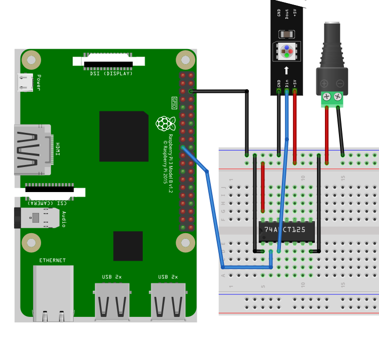

# Wiring your LEDs

WS281x LEDs are very simple to wire with their 3 LEDs. There are three options of how to wire, each detailed below.


**Make sure you have a sufficient power supply!**

You cannot power more than a handful of pixels direct from the Raspberry Pi - it can output a maximum of 500mA, which with a printer and camera connected leaves little left for LEDs. Please use an external power supply rated for the number of LEDs you have.



Using SPI to control the LEDs means you can **only use one LED strip at a time with the Raspberry Pi.** If you have more than one, you can 'chain' them together to make a longer strip.


## Raspberry Pi Wiring

The hardest part about wiring with a Raspberry Pi is connecting up the 3.3v logic from the Pi to the strip that wants 5v. There are several ways you can do this, which are described in more detail below.


All of the references to GPIO pins here are referring to the BCM Pin numbering. For more details on GPIO pins and the different ways of numbering them please see [pinout.xyz](https://pinout.xyz)


### No Level Shifting

It is possible to connect the LEDs up without any kind of level shifting, however mileage varies from strip to strip. I have one setup like this, and one with the full logic shifter. This can work because the spec of the LED strips means they need 0.7 \* VDD\(5v\) which is ~3.5v. Close to the Pi's 3.3, so depending on how tight of a tolerance your strip has, this is possible.

Wiring is as follows:

* Pi GND to LED GND
* Pi [GPIO 10](https://pinout.xyz/pinout/pin19_gpio10) to LED Data in
* Power supply GND to LED GND
* Power supply 5V to LED 5V


Make sure you have a common ground between the power supply and Pi.


### Level Shifting Chip

You can use a level shifting chip to convert the signals from 3.3v to 5v. Recommended one to use is a 74AHCT125, I have this and it works well.


 Please note that whilst the wiring below is on a breadboard, this is for illustrative purposes and is not suitable for high current installations. Test with a breadboard and few LEDs, then connect them directly.


Wiring of this is as follows:

* Common ground between:
  * Pi GND
  * LED GND
  * Power Supply GND
  * 74AHCT125 GND
  * 74AHCT125 pin 1OE
* Pi [GPIO 10](https://pinout.xyz/pinout/pin19_gpio10) to 74AHCT125 pin 1A
* 74AHCT125 pin 1Y to LED Data in
* Power supply 5V to:
  * 74AHCT125 VCC
  * LED 5V

### Wiring with a Diode

The diode method is a quick way to reduce the power supply voltage slightly, so that the LED strip can read the 3.3v.


 **Make sure you have a diode that can cope with the amount of power drawn!** As a result of them running at lower voltage the LEDs may not be as bright.



Please note that whilst the wiring below is on a breadboard, this is for illustrative purposes and is not suitable for high current installations. Test with a breadboard and few LEDs, then connect directly.


Wiring is as follows:

* Pi [GPIO 10](https://pinout.xyz/pinout/pin19_gpio10) to LED Data in
* Power supply 5V to 1N4001 diode anode \(side without the stripe\)
* 1N4001 diode cathode \(side with the stripe\) to LED 5V
* Power supply GND to Pi GND
* Power supply GND to LED GND

## On to the next stage: SPI setup



